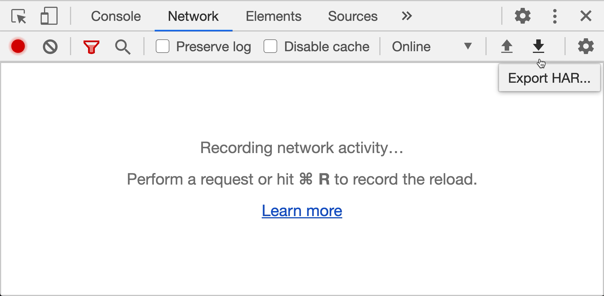
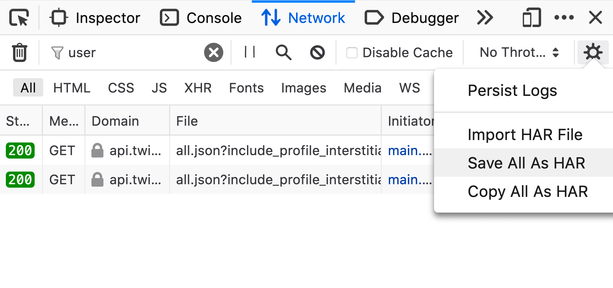

# @tapico/msw-webarchive

A utility to drive requests handlers through a `.har` web-archive file for the [Mock Service Worker](https://github.com/mswjs/msw) library. This utility allows you to mock server handlers by using `.har` web-archive file which can be created by using applications like Charles, ProxyMan or the Chrome Developer Tools.

## Why you use this?

We have been using it during the development of web-applications, while the backend API endpoints weren't available yet or when we want to reproduce a problem of a customer. This way we can request the customer to send us a .har web-archive file and let this file drive the network requests to our back-end, this has greatly eased reproducing problems reported.

## Getting started

To use this library you need to have a HAR (`*.har`) file generated from the network traffic of your application. Follow the instructions below to learn how to do that.

### Install

```bash
npm install @tapico/msw-webarchive --save-dev
```

### Install Mock Service Worker

Follow the [Installation instructions][msw-install] from the Mock Service Worker documentation.

### Create a HAR file

#### Chrome



- Open the DevTools in Chrome (<kbd>Option</kbd> + <kbd>Command</kbd> + <kbd>I</kbd> / <kbd>Shift</kbd> + <kbd>CTRL</kbd> + <kbd>J</kbd>).
- Go to the "_Network_" tab in the DevTools.
- Click on the downward-facing arrow icon to "_Export HAR_".
- Save the HAR archive on your disk.

#### Firefox



- Open the DevTools in Firefox (<kbd>Option</kbd> + <kbd>Command</kbd> + <kbd>I</kbd> / <kbd>Shift</kbd> + <kbd>CTRL</kbd> + <kbd>I</kbd>).
- Go to the "_Network_" tab in the DevTools.
- Click on the cog icon on the left of the top bar.
- Click "_Save All As HAR_" option in the dropdown menu.
- Save the HAR archive on your disk.

### Generate request handlers

```js
import { setupWorker } from 'msw'
import { setRequestHandlersByWebarchive } from '@tapico/msw-webarchive'
import * as traffic from './example.har'

const worker = setupWorker()
setRequestHandlersByWebarchive(worker, traffic)

worker.start()
```

## Options

### `quiet: boolean`

- Default: `false`

Disables the logging of debugging messages of the library.

```js
setRequestHandlersByWebarchive(worker, har, {
  quiet: true,
})
```

### `strictQueryString: boolean`

- Default: `true`

Stricly match a request URL query parameters during request URL matching. When set to `false`, request URL query parameters are ignored during matching.

```js
setRequestHandlersByWebarchive(worker, har, {
  strictQueryString: false,
})
```

### `resolveCrossOrigins: (origin: string) => string`

- Default: `undefined`

Override the `Access-Control-Allow-Origin` response header whenever it's present.

```js
setRequestHandlersByWebarchive(worker, har, {
  resolveCrossOrigins(origin) {
    return '*'
  },
})
```

### `domainMappings: Record<string, string>`

- Default: `undefined`

Allow mapping the domains in your har file to something else. This may be useful if you are making relative requests against the origin (eg. `fetch('/hello')`), you may want to use a domainMapping configuration like: 

```js
setRequestHandlersByWebarchive(worker, har, {
  domainMappings: {
    "http://example.com" : "http://localhost"    
  }
}); 
```


[msw-install]: https://mswjs.io/docs/getting-started/install
